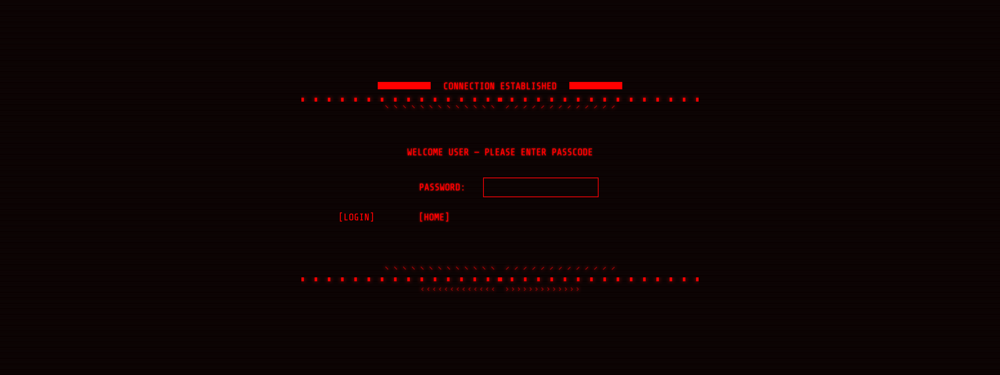

# Code-quiz

## Description
Introducing version 2 of Code Quiz this fun interactive quiz games will help users to test their coding knowledge while enjoy a retro terminal theme and multiple difficulty levels. this application was built with jquery and features audio in the form of background music and sound effect for when you get a question right or wrong. the application also features a score board where you can see saved scores and a contact form where users can give comments and concerns. hope you have fun playing 😁

## Deployed Application

https://sam-dejesus.github.io/Code-Quiz2/

## Usage
To use this application the user waits for the loading section to finish(for cosmetic use) after that they will pick a difficulty setting and press start. depending on the difficulty settings the user will time will be anywhere from 75-150 seconds. each wrong answer will deduct 15 seconds. once the quiz ends by completion or by time running out the user will be greeted with a with their score and and an option to save their score and to reset the quiz. 
-p.s be sure to use the console to unlock the secret message

## Views
**Homepage**

**scoreboard**

**Secret Menu**

**Achievements**

## Technologies Used

- JQUERY

## License
MIT License

Copyright (c) 2023 Samuel DeJesus

Permission is hereby granted, free of charge, to any person obtaining a copy of this software and associated documentation files (the "Software"), to deal in the Software without restriction, including without limitation the rights to use, copy, modify, merge, publish, distribute, sublicense, and/or sell copies of the Software, and to permit persons to whom the Software is furnished to do so, subject to the following conditions:

The above copyright notice and this permission notice shall be included in all copies or substantial portions of the Software.

THE SOFTWARE IS PROVIDED "AS IS", WITHOUT WARRANTY OF ANY KIND, EXPRESS OR IMPLIED, INCLUDING BUT NOT LIMITED TO THE WARRANTIES OF MERCHANTABILITY, FITNESS FOR A PARTICULAR PURPOSE AND NONINFRINGEMENT. IN NO EVENT SHALL THE AUTHORS OR COPYRIGHT HOLDERS BE LIABLE FOR ANY CLAIM, DAMAGES OR OTHER LIABILITY, WHETHER IN AN ACTION OF CONTRACT, TORT OR OTHERWISE, ARISING FROM, OUT OF OR IN CONNECTION WITH THE SOFTWARE OR THE USE OR OTHER DEALINGS IN THE SOFTWARE.

## Contact
Email: sdejesus484@gmail.com
Linkedin: https://www.linkedin.com/in/samuel-dejesus/